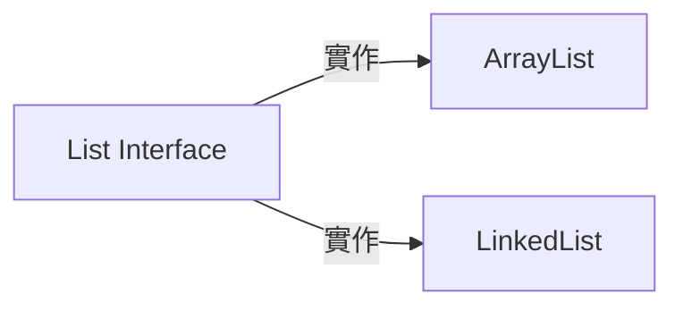
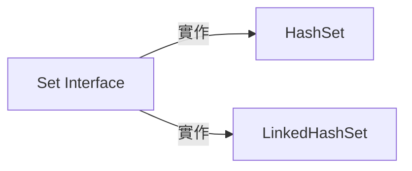
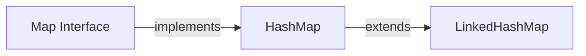

#   List



*   ArrayList   
    *   可以不用宣告大小
    *   支援隨機存取
    *   Use ArrayList when you need fast random access to elements by index.    
    *   Uses less memory because it stores elements in a contiguous array. However, it might reserve extra capacity for future growth.

*   LinkedList  
    *   需要遍歷的方式才能找到元素
    *   Inserting or deleting elements in the middle of the list is more efficient
```
		List<String> a = new ArrayList<>();
		a.add("Michael");
		a.add("Joan");
		System.out.println(a.size());
		for(String name:a) {
			System.out.println(name);
		}
        a.forEach(System.out::println);
        a.forEach(fruit -> System.out.println(fruit));
```
#   Set

Set是一個Interface。
有最簡單的Collection資料結構 - 集合。   
Set 唯一的限制是不允許重覆的物件存在。所以當你不想有相同的物件出現，就可以選擇用Set，同時選擇合適的實作。
Set常用的實作主要有3個：
    
-LinkedHashSet  
*   保證裡面元素存放的順序與新增時相同。最適合拿來存放由資料庫中存取的資料集。  

-HashSet   
*   讀取特快，但不保證存放元素的順序。  

-TreeSet   
*   依物件大小來決定集合裡面的順序。所以存放於TreeSet中元素必需是(實作) Comparable的物件。有時候當從自料庫中存取的資料必需自行排序時，就會用到。
```
	public static void main(String[] args) {
		String A = "My name is Michael Michael";
		String[] tokens = A.split(" ");
        Set<String> wordsInOrder = new LinkedHashSet <>();
        Set<String> wordsInHash = new HashSet <>();
        for(String token : tokens ) {
        	wordsInOrder.add(token);
        }
        
        System.out.printf("結果: 沒有重複的單字有%d個 = %s%n",
        		wordsInOrder.size(), wordsInOrder);
        
        for(String token : tokens ) {
        	wordsInHash.add(token);
        }
        
        System.out.printf("結果: 沒有重複的單字有%d個 = %s%n",
        		wordsInHash.size(), wordsInHash);
   }

```


#   Array --> Java.lang.object
*   Array
    *   需要先宣告大小
    *   All arrays in Java are implicitly derived from the java.lang.Object class, which means arrays inherit methods from Object such as clone(), toString(), and equals().
#   Map

*   HashMap:    
Best for scenarios where the order of elements doesn’t matter, and you need fast lookups and inserts.

*   LinkedHashMap:  
Useful when you need a map where the order of elements matters (either insertion order or access order). For example:      
A cache that discards the least recently used (LRU) entry can be implemented using a LinkedHashMap with access-order mode.