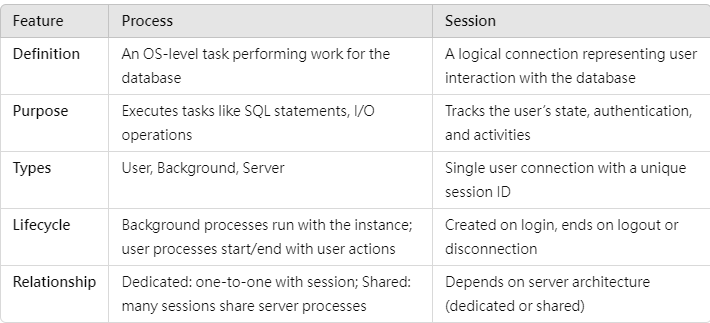

#   Database Session
###  Oracle Session & Process
*   每個SQL Login 稱為connection，每個connection 可以產生一個或多個session，多個session 可對應一個process ，或一個session 對應一個process。
*   結論︰
    1. sessions的值是根据processes的值计算得到的，一般情况下只需要设置processes的值即可。
    2. process 的目的就是執行statements ，session 目的就是認證



```
由于SESSIONS的值是根据PROCESSES的值计算得到的，所以，一般情况下只需要设置PROCESSES的值即可。在Oracle 11gR2以下版本中，SESSIONS大小的计算公式为：(1.1 * PROCESSES) + 5；在Oracle 11gR2中，SESSIONS大小的计算公式为：(1.5 * PROCESSES) + 22。若SESSIONS的当前值比计算值大的话，则SESSIONS的值可能保持不变；若SESSIONS的当前值比计算值小的话，则SESSIONS取计算值，即SESSIONS的值总是取MAX（当前值，计算值），但是这个也不是绝对的。

当数据库连接的并发用户已经达到SESSIONS的值时，又有新会话连接进来，就会报错“ORA-00018,"maximum number of sessions exceeded"”的错误。

当Oracle需要启动新的PROCESS，而当前的进程数又已经达到PROCESSES参数时，就会报错：“ORA-00020: maximum number of processes (2048) exceeded”。

如果数据库上连接被占用完，当新的连接过来时，那么就会在客户端产生“ORA-12519, TNS:no appropriate service handler found”的报错信息。
-->哇靠連接數被佔滿~ 為什麼我的那個寫法不會被釋放
```
*   範例︰
```
public class OracleSelectExample {

    // Database connection parameters
    private static final String DB_URL = "jdbc:oracle:thin:@localhost:1521:orcl";
    private static final String DB_USER = "your_username";
    private static final String DB_PASSWORD = "your_password";

    public static void main(String[] args) {
        // SQL query to execute
        String sql = "SELECT id, name, age FROM members";

        // Use try-with-resources to ensure resources are closed automatically
        try (
                Connection connection = DriverManager.getConnection(DB_URL, DB_USER, DB_PASSWORD);
                PreparedStatement statement = connection.prepareStatement(sql);
                ResultSet resultSet = statement.executeQuery()
             ) {

            // Process the ResultSet
            while (resultSet.next()) {
                int id = resultSet.getInt("id");
                String name = resultSet.getString("name");
                int age = resultSet.getInt("age");

                // Print the row data
                System.out.printf("ID: %d, Name: %s, Age: %d%n", id, name, age);
            }

        } catch (SQLException e) {
            // Handle SQL exceptions
            e.printStackTrace();
        }
        // No need to explicitly close resources - they are closed automatically
    }
}
```
### mysql Connction pool
```
watch -n 1 'mysql -u root -p -e "SHOW STATUS LIKE \'Threads_connected\'"'

```

```
application "pooled" 表示會reused connection 
然後資料庫本身也會有connection 的最大數
```

### 如果是用java jsp 不是用tomcat resource 是有辦法控制connection 的idle timeout 時間
```
import com.zaxxer.hikari.HikariConfig;
import com.zaxxer.hikari.HikariDataSource;

import javax.sql.DataSource;
import java.sql.Connection;
import java.sql.PreparedStatement;
import java.sql.ResultSet;
import java.sql.SQLException;

public class ConnectionPoolExample {

    private static final String JDBC_URL = "jdbc:mysql://localhost:3306/mydatabase";
    private static final String USER = "your_username";
    private static final String PASSWORD = "your_password";
    
    private static DataSource dataSource;

    static {
        HikariConfig config = new HikariConfig();
        config.setJdbcUrl(JDBC_URL);
        config.setUsername(USER);
        config.setPassword(PASSWORD);
        config.setMaximumPoolSize(10);  // Set maximum number of connections in the pool
        config.setConnectionTimeout(2000);  // Set connection timeout in milliseconds

        dataSource = new HikariDataSource(config);
    }

    public static void main(String[] args) {
        String query = "SELECT id, name, age FROM members";

        // Use try-with-resources for automatic resource management
        try (Connection connection = dataSource.getConnection();
             PreparedStatement statement = connection.prepareStatement(query);
             ResultSet resultSet = statement.executeQuery()) {

            // Process the ResultSet
            while (resultSet.next()) {
                int id = resultSet.getInt("id");
                String name = resultSet.getString("name");
                int age = resultSet.getInt("age");

                System.out.printf("ID: %d, Name: %s, Age: %d%n", id, name, age);
            }

        } catch (SQLException e) {
            // Handle SQL exception, possibly due to a connection timeout
            System.err.println("Error: " + e.getMessage());
            e.printStackTrace();
        }
        // Connection, PreparedStatement, and ResultSet are automatically closed here
    }
}

```
   
   
