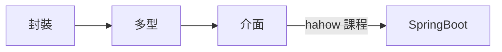

# JAVA Concept


## 封裝
* getter
* setter  
  
|修飾| 同一類別        | 同一套件 | 不同套件的子類別 | 不同套件的非子類別 |
|----|----------------|-------- |-----------------|------------------|
|private|V||||
|default|V|V
|protected|V|V|V
|public|V|V|V|V

* 如果在宣告類別成員時，其存取修飾超過類別存取修飾，則類 別成員的存取類別修飾受到約束，也就是以類別上的存取 修飾為類別成員的存取修飾。例如：  
```
class Some {
    public int data;
}
//data受到Some的約束，為package存 取範圍。
//不同套件的子類別意思為需繼承後才可存取
```
*   **我自己的想法是︰封裝就是重點在修飾詞以及getter和setter**
## 繼承
```
class Animal{
    int height;
    int weight;
    int age;
    void move(){
    } 
} // end of class Animal

class Dog extends Animal{
    Color hair;
    void eat(){
    }
    void sleep(){
    }
    void bark(){
    }
} // end of class Dog

//特別要提的是Java只支援『單向繼承』，也就是說一個子類別只可以有一個父類別，不過一個父類別可以被多個子類別繼承。
```


*   關鍵字 this 、 super
    * this 指自己類別的成員
    * this(.) 自己的建構子


```
    class Human{
        String name;
        int age;
        static int totalCount = 0;
        Human(){
            name = "untitled";
            age = -1;  // 使用-1來標記沒有被設定，否則會初始化為0，但人類有可能0歲
            totalCount++;
        }
        Human(String str){  
            this();                          
            this.name = str;
        }
        Human(String str,int a){
            this(str);  
            this.age = a;
        }
        void printInfo(){
            System.out.println(name+" 年齡："+age+" 目前總人數："+totalCount);
        }
    }
    //this(.) 建構子只能放在第一行！！！
```

* super  指到父類別，使用方法與this 相似
```
class Animal {
    int height;
    int weight;
    static int totalCount = 0;

    Animal() {
        this(-1, -1);
    }
    Animal(int h) {
        this(h, -1);
    }
    Animal(int h, int w) {
        this.height = h;
        this.weight = w;
        totalCount++;
    }
    String getInfo() {
        return "身長：" + height + " 重量：" + weight;
    }
} // end of class Animal

class Dog extends Animal{
	
	Dog(){this.height = 10;}//自動繼承Animal 的類別成員	
	
}


class Dog extends Animal {
    String color;
    static int totalCount = 0;

    Dog() {
        this(-1, -1, "noset");//一律指到三個變數的建構子
    }
    Dog(int h, int w) {
        this(h, w, "noset");//一律指到三個變數的建構子
    }
    Dog(String c) {
        this(-1, -1, c);//一律指到三個變數的建構子
    }
    Dog(int h, int w, String c) {
        super(h, w);//height and weight 由父類別的建構子來指定類別成員
        this.color = c;
        totalCount++;
    }
    String getInfo() {
        return super.getInfo() + " 毛色：" + this.color;
    }
} // end of class Dog
Animal中帶有兩個參數的建構子 Animal(int h,int w) 視為主要負責初始化功能的運算子，其他參數比較少的建構子就負責呼叫這個建構子。

Dog的建構子中，主要運做的是 Dog(int h,int w,String c)，其他參數比較少的運算子只需要設計應該帶什麼參數給他。 這種被稱為方法的包裝(wrapped) 是常見且比較容易設計的做法。
```

*   **我自己的想法是，繼承就是類別成員、類別方法都可以繼承，this可以用this(String str,Int integ)來繼承**

##  多型
```
class Animal {
    void move() {
        System.out.println("move...move...");
    }
}
class Dog extends Animal {
    void move() {
        System.out.println("跑...跑...");
    }
}
class Bird extends Animal {
    void move() {
        System.out.println("飛...飛...");
    }
}

```
```
class Test {
    public static void main(String[] args) {

        Animal a=new Animal();
        Animal b =new Dog();
        Animal c =new Bird();

        moveAnimal(a);
        moveAnimal(b);
        moveAnimal(c);

    }    
    static void  moveAnimal(Animal ani){
        ani.move();//這裡就是那一個子類別的物件放進去，就會使用該子類別改寫的方法。
    }
}// end of class Test
```
執行結果︰
```
move...move...
跑...跑...
飛...飛...
```
*   我自己的想法是︰**多型就是把父類別的方法先繼承下來後，在子類別可以作改寫，同時可以用父類別去new 出子類別的物件。     

    要記住繼承子類別可轉型為父類別的寫法，對程式的架構來講會變的很簡潔** 

##  參考

* [https://yubin551.gitbook.io/java-note/object_oriented_programming/encapsulation] Java備忘筆記

