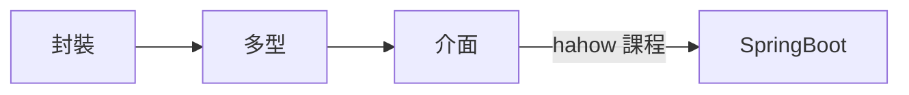

# JAVA Concept


## 封裝
* getter
* setter  
  
|修飾| 同一類別        | 同一套件 | 不同套件的子類別 | 不同套件的非子類別 |
|----|----------------|-------- |-----------------|------------------|
|private|V||||
|default|V|V
|protected|V|V|V
|public|V|V|V|V

* 如果在宣告類別成員時，其存取修飾超過類別存取修飾，則類 別成員的存取類別修飾受到約束，也就是以類別上的存取 修飾為類別成員的存取修飾。例如：  
```
class Some {
    public int data;
}
//data受到Some的約束，為package存 取範圍。
//不同套件的子類別意思為需繼承後才可存取
```
*   **我自己的想法是︰封裝就是重點在修飾詞以及getter和setter**
## 繼承
```
class Animal{
    int height;
    int weight;
    int age;
    void move(){
    } 
} // end of class Animal

class Dog extends Animal{
    Color hair;
    void eat(){
    }
    void sleep(){
    }
    void bark(){
    }
} // end of class Dog

//特別要提的是Java只支援『單向繼承』，也就是說一個子類別只可以有一個父類別，不過一個父類別可以被多個子類別繼承。
```


*   關鍵字 this 、 super
    * this 指自己類別的成員
    * this(.) 自己的建構子


```
    class Human{
        String name;
        int age;
        static int totalCount = 0;
        Human(){
            name = "untitled";
            age = -1;  // 使用-1來標記沒有被設定，否則會初始化為0，但人類有可能0歲
            totalCount++;
        }
        Human(String str){  
            this();                          
            this.name = str;
        }
        Human(String str,int a){
            this(str);  
            this.age = a;
        }
        void printInfo(){
            System.out.println(name+" 年齡："+age+" 目前總人數："+totalCount);
        }
    }
    //this(.) 建構子只能放在第一行！！！
```

* super  指到父類別，使用方法與this 相似
```
class Animal {
    int height;
    int weight;
    static int totalCount = 0;

    Animal() {
        this(-1, -1);
    }
    Animal(int h) {
        this(h, -1);
    }
    Animal(int h, int w) {
        this.height = h;
        this.weight = w;
        totalCount++;
    }
    String getInfo() {
        return "身長：" + height + " 重量：" + weight;
    }
} // end of class Animal

class Dog extends Animal{
	
	Dog(){this.height = 10;}//自動繼承Animal 的類別成員	
	
}


class Dog extends Animal {
    String color;
    static int totalCount = 0;

    Dog() {
        this(-1, -1, "noset");//一律指到三個變數的建構子
    }
    Dog(int h, int w) {
        this(h, w, "noset");//一律指到三個變數的建構子
    }
    Dog(String c) {
        this(-1, -1, c);//一律指到三個變數的建構子
    }
    Dog(int h, int w, String c) {
        super(h, w);//height and weight 由父類別的建構子來指定類別成員
        this.color = c;
        totalCount++;
    }
    String getInfo() {
        return super.getInfo() + " 毛色：" + this.color;
    }
} // end of class Dog
Animal中帶有兩個參數的建構子 Animal(int h,int w) 視為主要負責初始化功能的運算子，其他參數比較少的建構子就負責呼叫這個建構子。

Dog的建構子中，主要運做的是 Dog(int h,int w,String c)，其他參數比較少的運算子只需要設計應該帶什麼參數給他。 這種被稱為方法的包裝(wrapped) 是常見且比較容易設計的做法。
```

*   **我自己的想法是，繼承就是類別成員、類別方法都可以繼承，this可以用this(String str,Int integ)來繼承**

##  多型
### 利用父類別提供的方法呼叫，子類別可以有自己特有的行為。
```
class Animal {
    void move() {
        System.out.println("move...move...");
    }
}
class Dog extends Animal {
    void move() {
        System.out.println("跑...跑...");
    }
}
class Bird extends Animal {
    void move() {
        System.out.println("飛...飛...");
    }
}

```
```
class Test {
    public static void main(String[] args) {

        Animal a=new Animal();
        Animal b =new Dog();
        Animal c =new Bird();

        moveAnimal(a);
        moveAnimal(b);
        moveAnimal(c);

    }    
    static void  moveAnimal(Animal ani){
        ani.move();//這裡就是那一個子類別的物件放進去，就會使用該子類別改寫的方法。
    }
}// end of class Test
```
執行結果︰
```
move...move...
跑...跑...
飛...飛...
```
*   我自己的想法是︰**多型就是把父類別的方法先繼承下來後，在子類別可以作改寫，同時可以用父類別去new 出子類別的物件。     

    要記住繼承子類別可轉型為父類別的寫法，對程式的架構來講會變的很簡潔** 

##  抽象
### 不把抽象類別的方法實作出來，讓子類別去實作就不用管抽象本身方法，只專注在子類別繼承後的實作方法了。
*   抽象類別不能被實體化
    *   利用修飾子abstract，可以使方法變成抽象方法，抽象方法只能寫方法的原型，無法定義方法的本體。 
    `ex: abstract void eat(); //加大括號就會出錯`
    
        類別

        讓類別變成抽象類別，不能建立實體，專門用來『被繼承』。

        方法

        讓方法變成抽象方法，只能定義原型，專門用來『被覆寫』。
        ```
        abstract class Animal{
            int weight,heigh;
            void setValue(int w,int h){
                this.weight = w;
                this.height = h;
            }
            abstract void eat();
        }
        class Dog extends Animal{
            void eat(){
                System.out.println("啃骨頭...");
            }
        }
        class Bird extends Animal{
            void eat(){
                System.out.println("早起吃蟲...");
            }
        }
        ```
##  介面
### 描述不同類別的共通行為。
####    抽象與介面的差別︰
1.   建構子  
        *   抽象類別：  
    可以擁有建構子，用來初始化抽象類別中的欄位。    
        *   介面：  
    `**不可以有建構子，因為不能直接建立介面的實例。**`    

2.   修飾詞
        *   抽象類別：  
            可以擁有實例變數，可以有預設值或沒有預設值。    
            這些欄位可以有任何訪問修飾符（private、protected、public 等）。
        *   介面：  
            只能擁有public static final變數（常數）。   
            這些變數隱式地是 public、static 和 final，因此不能更改。    
3.  方法    
    *   抽象類別    
        可以有抽象方法和具體方法(不要加abstract 修飾詞就是具體方法)    
    *   介面    
        只能有抽象方法(Java 8 之後可以有 default/static 方法)   
        介面的方法一定要被實作
    
   
4.  使用情境    
       *    抽象類別   
            當類別之間有共同行為或狀態（欄位），但某些方法需要由子類別實作時，適合使用。    
            例如，Animal（動物）抽象類別可能有像 name 這樣的欄位，還有像 eat() 這樣的具體方法，但強制子類別（如 Dog 和 Cat）實作 sound() 方法。    
       *    介面    
            當你想要定義一個不同類別都必須遵循的合約時，適合使用介面。實作相同介面的類別不需要是相關的，但它們必須提供該介面中定義的行為。  
            例如，Flyable（可飛行）介面可能被 Bird（鳥）和 Airplane（飛機）實作。  
5.  總結Interface    
```
    1.  變數︰介面的成員變數是final 不能被改。
    2.  方法︰抽象和介面都可以有抽象方法(方法原形)和有實作的方法，繼承的子類別一定要實作抽象方法。


用於被實作，子類別要實作定義的方法。

介面中只能定義方法原型，不能有方法本體。//Java 8 之後可以有 default/static 方法本體

方法的修飾子必為public abstract，欄位的修飾子必為public static final，可省略不可衝突。

定義的資料欄位用於作為常數使用。(因為修飾子為public static final)

設計中心以方法(行為)為主體。

一般來說有共同的概念可以繼承相同的抽象父類別，

若只是行為相同以介面來設計會比較恰當。

實務上先考慮介面的劃分會比較方便，畢竟類別可以繼承多個介面，需要用到層層的欄位概念再使用類別去繼承。    

You can define an interface in the same .java file as another class or interface, as long as only one of them is public (and the filename matches the public class/interface).  

You can also define an interface inside another class (inner interface) 

抽象類別也可以繼承介面，但不一定要實作方法，


```
6.  範例︰   
```
public interface Power {
	int value =20;//介面可以有成員變數
	static String name ="";//介面可以有成員變數
	
	//Power();//介面不能有建構子。因為不能直接建立介面的實例
    
    static void getName() {//Java 8 之後可以有 default/static 方法
    	System.out.println("hello");
    };
    
    //void E() {};//因為加了body , 所以需加上static 才不會發生錯誤
    
	void getPoweabstract ;//沒有實作方法，因為沒有加Body，所以不會出錯。
	

}
```

interface extends|implements abstract|interface 
    *   interface extends interface -->OK
    *   interface  implements interface  -->NG  
    *   interface extends abstract only -->NG   
    *   interface  implements abstract  -->NG   

abstract  extends|implements abstract|interface     
    *   abstract extends abstract-->OK  
    *   abstract implements abstract -->NG  
    *   abstract extends interface-->NG   
    *   abstract implements interface -->OK


##  參考

* [https://yubin551.gitbook.io/java-note/object_oriented_programming/encapsulation] Java備忘筆記

##  一些轉成中文的名詞︰
*   成員變數-->Member Variable , Instance Variable
*   成員方法-->Method
*   實例-->Instance

