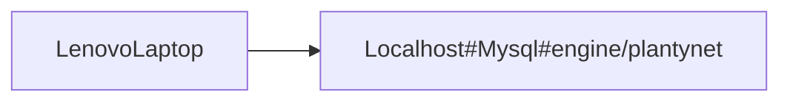
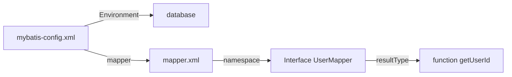
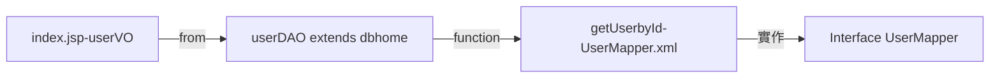

#  Mybatis

**Structure** 

**Componet**

**flowchart**



## Download mybatis , mysql connector   
   * Mybtais and mysql connector download location : 
     * https://blog.mybatis.org/ , click release page (https://github.com/mybatis/mybatis-3/releases/tag/mybatis-3.5.10) 
     * Then download zip files,there is jar file inside the zip file.
     * Mysql : you can visit (https://mvnrepository.com/) , seach the keyword of the jar file , you will see download link at the `Files` row
 
## Create mybtais-config.xml  
* content
```
<?xml version="1.0" encoding="UTF-8" ?>
<!DOCTYPE configuration PUBLIC "-//mybatis.org//DTD Config 3.0//EN" "http://mybatis.org/dtd/mybatis-3-config.dtd">

<configuration>
    <properties resource="db.properties"/>
    <environments default="development">
        <environment id="development">
            <transactionManager type="JDBC" />
                <dataSource type="POOLED">
                <property name="driver" value="${driver}" />
                <property name="url" value="${url}" />
                <property name="username" value="${username}" />
                <property name="password" value="${password}" />
            </dataSource>
        </environment>
    </environments>
    
    <mappers>
        <mapper resource="com/yourproject/mappers/UserMapper.xml" />
    </mappers>
</configuration>
  ```

* note  
    * dataSource type="POOLED" --> 数据源的配置about connection pool , ex:'UNPOOLED,POOLED,JNDI'
    * transactionManager type="JDBC":    
    `
    MyBatis uses the native JDBC API to manage transactions (commit() and rollback()).
It's ideal for standalone applications or when you don’t have an external transaction manager.
transactionManager type="MANAGED": MyBatis defers transaction management to an external system (like Spring or a Java EE container).`

## Create UserMapper.xml
```
<?xml version="1.0" encoding="UTF-8" ?>
<!DOCTYPE mapper
  PUBLIC "-//mybatis.org//DTD Mapper 3.0//EN"
  "http://mybatis.org/dtd/mybatis-3-mapper.dtd">

<mapper namespace="com.yourproject.mappers.UserMapper">
    <select id="getUserById" parameterType="int" resultType="com.yourproject.model.User">
        SELECT * FROM member WHERE id = #{id};
    </select>
</mapper>
```
* note
    * `namespace="com.yourproject.mappers.UserMapper"` indicates that this particular XML file is associated with the UserMapper interface located in the com.yourproject.mappers package.  
    The namespace is essentially a link between the SQL queries defined in the XML file and the Java UserMapper interface. 
    * `select Element` : This is the MyBatis tag used to define an SQL SELECT query.
    * `id="getUserById"`: This id corresponds to a method name in the Mapper interface (e.g., getUserById(int id)).  
    When the getUserById(int id) method is called in Java code, MyBatis knows to execute the SQL query that is associated with this id in the XML file.
    * `parameterType="int"`:The parameterType attribute specifies the type of the parameter that will be passed to this SQL query.  
    It tells MyBatis what kind of parameter to expect when this SQL query is executed.
    * `resultType="com.yourproject.model.User"`:The resultType attribute defines the type of object that will be returned by this SQL query   
    It tells MyBatis how to map the result set returned by the SQL query to a Java object.


## Create Interface UserMapper
```
package com.yourproject.mappers;

import com.yourproject.model.User;

public interface UserMapper {
    User getUserById(int id);
}
```
*    note
    * interface 的意義在於用同樣的一個Interface 可定義不同類別的物件，而這些類別物件就可使用同個資料庫。