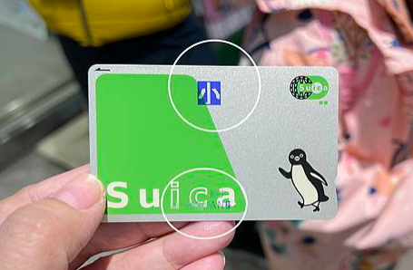
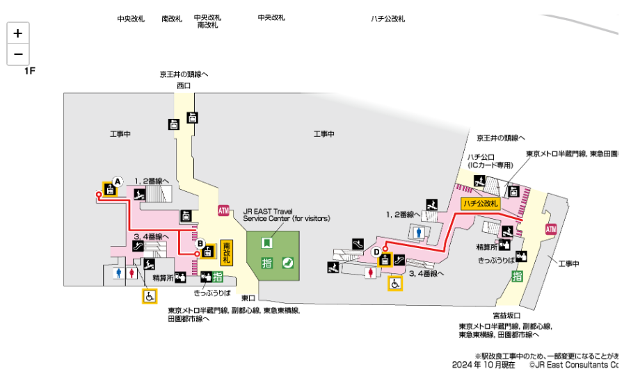
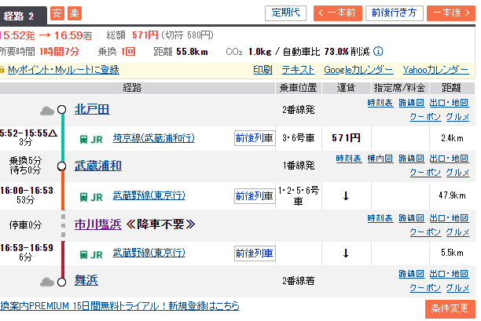
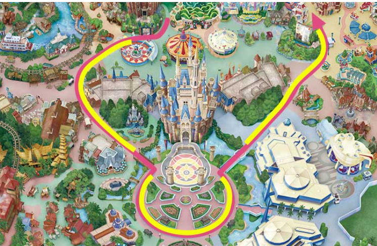
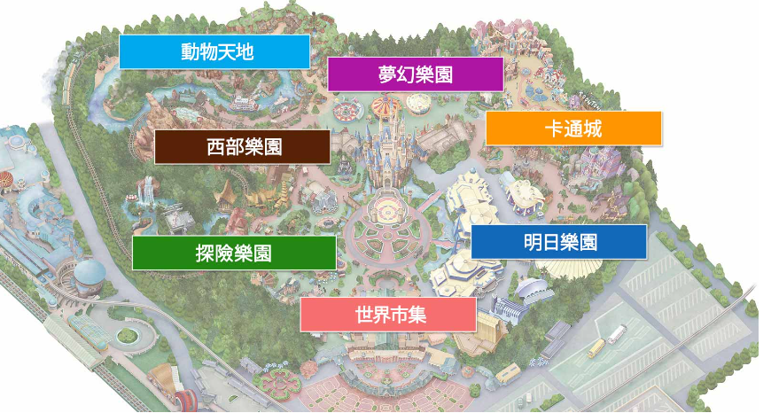
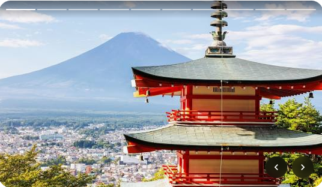
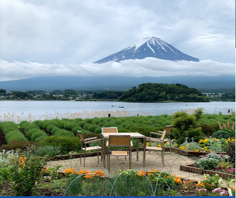
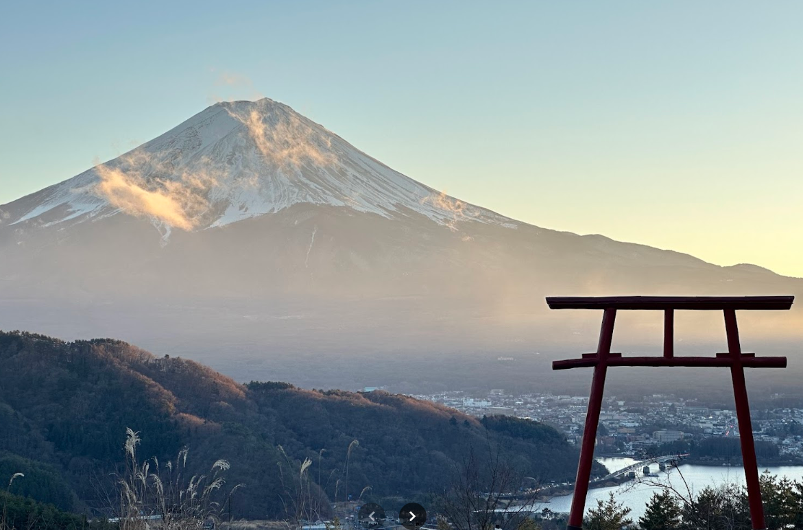
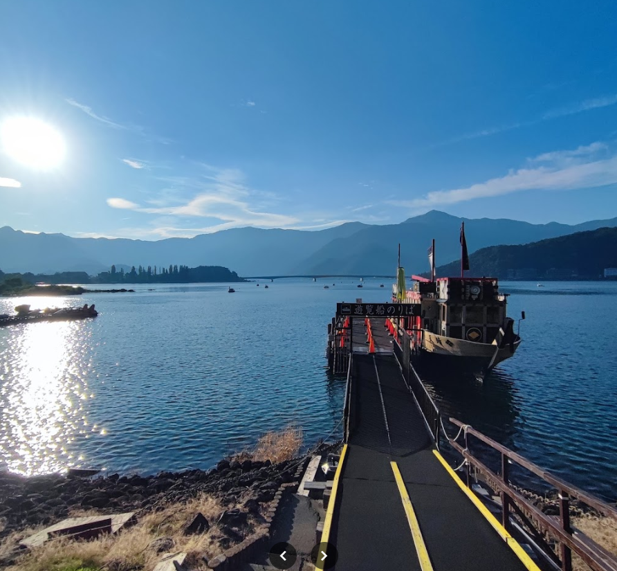

#   2024/10/17 迪士尼
*   營業時間 0900:2100
*   人數預測[http://www15.plala.or.jp/gcap/disney/?spm=BlogArticle.InArticleHyperlinkWord&clickId=533d628fd5]
##  JR 怎麼搭最舒服
*   學童票那裡買
    *   6歲(6~12)以上的孩子搭車要買票，票價為大人的50%。
    *   初次購買時需支付最低2000日圓(抽金500日圓)
    *   みどりの窓口 要去這個JR車站的窗口買
        *   成田機場有，但會排很長
        *   [https://www.jreast.co.jp/estation/facility_search.aspx?SearchCategoryCd=1] 這網站有寫那些車站有這窗口
        *   澀谷 一樓南改札外 (改札是檢票口的意思)
        *   `北戶田坐到澀谷要410日圓X2 = 台幣178元`
        *   可計算JR票價[https://japantravel.navitime.com/zh-tw/area/jp/route/calculator/]
    
    
    *   乘車一回看起來最輕鬆，但不同的時間所需的總搭乘時間不同，所以要當天出發時再查。
    *   
##  地圖
*   覺得有興趣
    *   世界世集
        *   1雙層巴士
    *   探險樂園
        *   23西部沿河鐵路
        *   24加勒比海盜
        *   25森林巡航
        *   26大樹屋(維修中)
    *   西部樂園
        *   51豪華馬克吐溫號
        *   52湯姆之島巨木筏
        *   53巨雷山
    *   動物天地
        *   飛濺山
        *   獨木舟歷險
    *   夢幻樂園
        *   75小小世界
        *   77白雪公主冒險旅程
        *   78仙履奇緣童話大廳(投影秀)17:50 / 20:15
        *   81美女與野獸
        *   83小熊維尼獵密記
    *   卡通城
        *   104雲宵飛車
    *   明日樂園
        *   1203D星際旅行
        *   122巴斯光年
        *   123杯麵
        *   124怪獸電力公司
        *   太空山
*   快速通關
    *   迪士尼尊享卡（Disney Premier Access）簡稱「DPA」，可以理解為「優先入場卡」的付費版，適用於以下超人氣遊樂設施・遊行及娛樂表演，每張園區票券僅可購買本人使用。
    *   東京迪士尼官方App中，有預約等候卡（Standby Pass，又稱SP）的功能，掃描門票上的QR code，就能抽取特定設施的排隊資格，因為人潮較多時，園方會只開放給有抽到預約等候卡的人排隊。

*   遊行
    *   10/17 12:25 迪士尼眾彩交融
    *   10/17 15:05 壞蛋萬聖節
    *   10/17 18:55 電子大遊行
    * 
*   重點遊戲
    *   124怪獸電力公司迷藏巡遊車
    *   83小熊維尼獵密記

*   SHOW
    *   探險樂園米奇樂跳跳要預約
        *   1025/1140/1330/1445/1600
    *   夢幻樂園米奇魔法音樂世界
        *   1050/1215/1340/1545/1710
*   

##  河口湖
*   新倉山淺間公園

*   大石公園 有冰淇林

*   音樂盒之森美術館

*   河口淺間神社要爬山可開車要排隊

*   河口湖遊覧船天晴

*   天上山公園覽車
*   忍野八海
*   

##  街口在日本事宜

